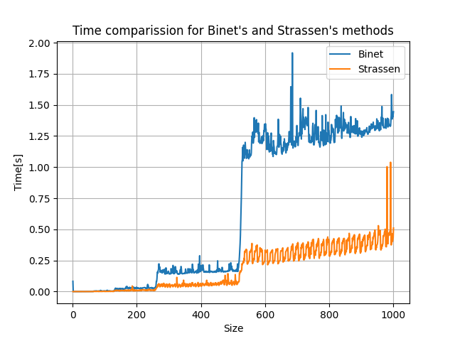
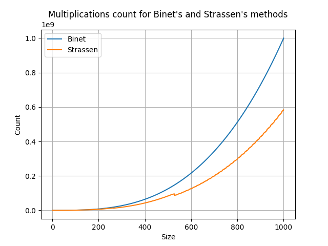
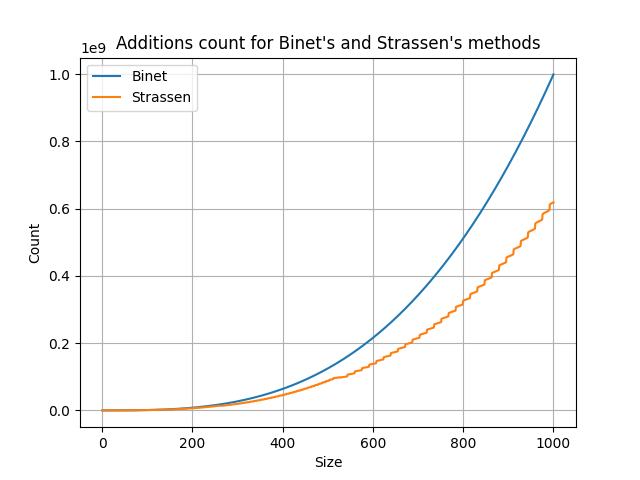
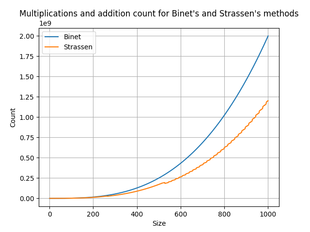
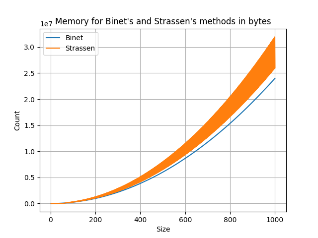

# Sprawozdanie z metod mnożenia macierzy

## Cel ćwiczenia

Celem ćwiczenia było zaimplementowanie i porównanie trzech metod mnożenia macierzy:

1. **Rekurencyjne mnożenie metodą Bineta**  
2. **Rekurencyjne mnożenie metodą Strassena**  
3. **Mnożenie macierzy metodą AI** na podstawie artykułu w [Nature](https://deepmind.google/discover/blog/discovering-novel-algorithms-with-alphatensor/#:~:text=In%20our%20paper,%20published%20today%20in%20Nature,%20we) 

oraz zbadanie ich:
- czasu działania,  
- liczby operacji zmiennoprzecinkowych,  
- zużycia pamięci,  
- przybliżonej złożoności obliczeniowej.

---

## Pseudokod rekurencyjnego algorytmu Bineta

    function BinetMultiply(A, B):
        n = liczba wierszy (A)
        if n == 1:
            // jedno mnożenie
            return [[A[0,0] * B[0,0]]]

        // Podział macierzy na 4 części
        (A11, A12, A21, A22) = split(A)
        (B11, B12, B21, B22) = split(B)

        // Rekurencyjne wywołania
        M1 = BinetMultiply(A11, B11)
        M2 = BinetMultiply(A12, B21)
        M3 = BinetMultiply(A11, B12)
        M4 = BinetMultiply(A12, B22)
        M5 = BinetMultiply(A21, B11)
        M6 = BinetMultiply(A22, B21)
        M7 = BinetMultiply(A21, B12)
        M8 = BinetMultiply(A22, B22)

        // Łączenie wyników częściowych
        C11 = M1 + M2
        C12 = M3 + M4
        C21 = M5 + M6
        C22 = M7 + M8

        // Składanie w macierz wynikową
        return combine(C11, C12, C21, C22)

## Najważniejsze fragmenty kodu

### Rekurencyjne mnożenie metodą Bineta

```python
def multiply_binet(M1, M2, count=None):
    if count is None: 
        count = {'add': 0, 'mul': 0}

    r1, c1 = M1.shape
    r2, c2 = M2.shape

    if c1 != r2:
        raise Exception("Invalid matrix sizes.")
    
    if min(r1, c1, r2, c2) <= 32:  # Zwiększony próg
        count['mul'] += r1 * c1 * c2
        count['add'] += r1 * (c1 - 1) * c2
        return M1 @ M2, count
    
    mid_r1, mid_c1 = r1//2, c1//2
    mid_r2, mid_c2 = r2//2, c2//2
    mid_c_res = c2//2

    A1 = M1[:mid_r1, :mid_c1]
    B1 = M1[:mid_r1, mid_c1:]
    C1 = M1[mid_r1:, :mid_c1]
    D1 = M1[mid_r1:, mid_c1:]
    
    A2 = M2[:mid_r2, :mid_c2]
    B2 = M2[:mid_r2, mid_c2:]
    C2 = M2[mid_r2:, :mid_c2]
    D2 = M2[mid_r2:, mid_c2:]
    
    P1, count = multiply_binet(A1, A2, count)
    P2, count = multiply_binet(B1, C2, count)
    P3, count = multiply_binet(A1, B2, count)
    P4, count = multiply_binet(B1, D2, count)
    P5, count = multiply_binet(C1, A2, count)
    P6, count = multiply_binet(D1, C2, count)
    P7, count = multiply_binet(C1, B2, count)
    P8, count = multiply_binet(D1, D2, count)
    
    UL = np.add(P1, P2, out=P1)  # reuse P1 memory
    UR = np.add(P3, P4, out=P3)  # reuse P3 memory  
    LL = np.add(P5, P6, out=P5)  # reuse P5 memory
    LR = np.add(P7, P8, out=P7)  # reuse P7 memory
    
    count["add"] += UL.size + UR.size + LL.size + LR.size
    
    res = np.empty((r1, c2), dtype=M1.dtype)
    res[:mid_r1, :mid_c_res] = UL
    res[:mid_r1, mid_c_res:] = UR
    res[mid_r1:, :mid_c_res] = LL
    res[mid_r1:, mid_c_res:] = LR
    
    return res, count
```

### Rekurencyjne mnożenie metodą Strassena

```python
def multiply_strassen(M1, M2, count=None):
    if count is None:
        count = {'add': 0, 'mul': 0}
    
    r1, c1 = M1.shape
    r2, c2 = M2.shape

    if c1 != r2:
        raise Exception("Invalid matrix sizes.")

    if min(r1, c1, r2, c2) <= 64:  # Zwiększony próg
        count['mul'] += r1 * c1 * c2
        count['add'] += r1 * (c1 - 1) * c2
        return M1 @ M2, count
    
    # Sprawdź czy macierze są parzyste
    if r1 % 2 == 0 and c1 % 2 == 0 and r2 % 2 == 0 and c2 % 2 == 0:
        mid_r1, mid_c1 = r1//2, c1//2
        mid_r2, mid_c2 = r2//2, c2//2
        mid_c_res = c2//2
        
        A1 = M1[:mid_r1, :mid_c1]
        B1 = M1[:mid_r1, mid_c1:]
        C1 = M1[mid_r1:, :mid_c1]
        D1 = M1[mid_r1:, mid_c1:]
        
        A2 = M2[:mid_r2, :mid_c2]
        B2 = M2[:mid_r2, mid_c2:]
        C2 = M2[mid_r2:, :mid_c2]
        D2 = M2[mid_r2:, mid_c2:]
        
        temp1 = np.empty_like(A1)
        temp2 = np.empty_like(A2)
        np.add(A1, D1, out=temp1)
        np.add(A2, D2, out=temp2)
        count['add'] += A1.size * 2
        P1, count = multiply_strassen(temp1, temp2, count)
        
        np.add(C1, D1, out=temp1)
        P2, count = multiply_strassen(temp1, A2, count)
        count['add'] += C1.size
        
        np.subtract(B2, D2, out=temp2)
        P3, count = multiply_strassen(A1, temp2, count)
        count['add'] += B2.size
        
        np.subtract(C2, A2, out=temp2)
        P4, count = multiply_strassen(D1, temp2, count)
        count['add'] += C2.size
        
        np.add(A1, B1, out=temp1)
        P5, count = multiply_strassen(temp1, D2, count)
        count['add'] += A1.size
        
        np.subtract(C1, A1, out=temp1)
        np.add(A2, B2, out=temp2)
        P6, count = multiply_strassen(temp1, temp2, count)
        count['add'] += C1.size + A2.size
        
        np.subtract(B1, D1, out=temp1)
        np.add(C2, D2, out=temp2)
        P7, count = multiply_strassen(temp1, temp2, count)
        count['add'] += B1.size + C2.size
        
        UL = np.add(P1, P4, out=P1)    # reuse P1
        np.subtract(UL, P5, out=UL)
        np.add(UL, P7, out=UL)
        
        UR = np.add(P3, P5, out=P3)    # reuse P3
        
        LL = np.add(P2, P4, out=P2)    # reuse P2
        
        LR = np.subtract(P1, P2, out=P1)
        np.add(LR, P3, out=LR)
        np.add(LR, P6, out=LR)
        
        count['add'] += P1.size * 8
        
        res = np.empty((r1, c2), dtype=M1.dtype)
        res[:mid_r1, :mid_c_res] = UL
        res[:mid_r1, mid_c_res:] = UR
        res[mid_r1:, :mid_c_res] = LL
        res[mid_r1:, mid_c_res:] = LR
        
        return res, count
    
    else:
        return multiply_strassen_odd_optimized(M1, M2, count)

def multiply_strassen_odd_optimized(M1, M2, count):
    r1, c1 = M1.shape
    r2, c2 = M2.shape
    
    M1_block, v1, w1, s1 = M1[:-1, :-1], M1[:-1, -1:], M1[-1:, :-1], M1[-1:, -1:]
    M2_block, v2, w2, s2 = M2[:-1, :-1], M2[:-1, -1:], M2[-1:, :-1], M2[-1:, -1:]
    
    M1M2, count = multiply_strassen(M1_block, M2_block, count)
    
    UL = np.empty_like(M1M2)
    UR = np.empty((M1_block.shape[0], 1), dtype=M1.dtype)
    LL = np.empty((1, M2_block.shape[1]), dtype=M1.dtype)
    
    v1w2 = v1 @ w2
    np.add(M1M2, v1w2, out=UL)
    
    M1v2 = M1_block @ v2
    v1s2 = v1 * s2[0,0] if s2.size == 1 else v1 @ s2
    np.add(M1v2, v1s2, out=UR)
    
    w1M2 = w1 @ M2_block
    s1w2 = s1[0,0] * w2 if s1.size == 1 else s1 @ w2
    np.add(w1M2, s1w2, out=LL)
    
    w1v2 = w1 @ v2
    s1s2 = s1[0,0] * s2[0,0] if s1.size == 1 and s2.size == 1 else s1 @ s2
    LR = w1v2 + s1s2
    
    count["add"] += UL.size + UR.size + LL.size + LR.size
    count["mul"] += (v1.size + M1_block.size + M2_block.size + 
                    w2.size + w1.size + 1)
    
    res = np.empty((r1, c2), dtype=M1.dtype)
    res[:-1, :-1] = UL
    res[:-1, -1:] = UR
    res[-1:, :-1] = LL
    res[-1:, -1:] = LR
    
    return res, count
```

### Mnożenie macierzy metodą AI

```python
def multiply_nature(M1, M2):
    if not isinstance(M1, np.ndarray):
        M1 = np.array(M1)
    if not isinstance(M2, np.ndarray):
        M2 = np.array(M2)

    m1, n1 = M1.shape
    m2, n2 = M2.shape

    if m1 != 4 or not (n1 == m2 == n2 == 5):
        raise Exception("Invalid matrix sizes: should be (4x5)*(5x5)")
    
    h1 = M1[2][1] * (-M2[1][0] - M2[1][4] - M2[2][0])
    h2 = (M1[1][1] + M1[1][4] - M1[2][4]) * (-M2[1][4] - M2[4][0])
    h3 = (-M1[2][0] - M1[3][0] + M1[3][1]) * (-M2[0][0] + M2[1][4])
    h4 = (M1[0][1] + M1[0][3] + M1[2][3]) * (-M2[1][4] - M2[3][0])
    h5 = (M1[0][4] + M1[1][1] + M1[1][4]) * (-M2[1][3] + M2[4][0])
    h6 = (-M1[1][1] - M1[1][4] - M1[3][4]) * (M2[1][2] + M2[4][0])
    h7 = (-M1[0][0] + M1[3][0] - M1[3][1]) * (M2[0][0] + M2[1][3])
    h8 = (M1[2][1] - M1[2][2] - M1[3][2]) * (-M2[1][2] + M2[2][0])
    h9 = (-M1[0][1] - M1[0][3] + M1[3][3]) * (M2[1][2] + M2[3][0])
    h10 = (M1[1][1] + M1[1][4]) * M2[4][0]

    h11 = (-M1[1][0] - M1[3][0] + M1[3][1]) * (-M2[0][0] + M2[1][1])
    h12 = (M1[3][0] - M1[3][1]) * M2[0][0]
    h13 = (M1[0][1] + M1[0][3] + M1[1][3]) * (M2[1][1] + M2[3][0])
    h14 = (M1[0][2] - M1[2][1] + M1[2][2]) * (M2[1][3] + M2[2][0])
    h15 = (-M1[0][1] - M1[0][3]) * M2[3][0]
    h16 = (-M1[2][1] + M1[2][2]) * M2[2][0]
    h17 = (M1[0][1] + M1[0][3] - M1[1][0] + M1[1][1] - M1[1][2] + M1[1][3] - M1[2][1] + M1[2][2] - M1[3][0] + M1[3][1]) * M2[1][1]
    h18 = M1[1][0] * (M2[0][0] + M2[0][1] + M2[4][1])
    h19 = -M1[1][2] * (M2[2][0] + M2[2][1] + M2[4][1])
    h20 = (-M1[0][4] + M1[1][0] + M1[1][2] - M1[1][4]) * (-M2[0][0] - M2[0][1] + M2[0][3] - M2[4][1])

    h21 = (M1[1][0] + M1[1][2] - M1[1][4]) * M2[4][1]
    h22 = (M1[0][2] - M1[0][3] - M1[1][3]) * (M2[0][0] + M2[0][1] - M2[0][3] - M2[2][0] - M2[2][1] + M2[2][3] + M2[3][3])
    h23 = M1[0][2] * (-M2[2][0] + M2[2][3] + M2[3][3])
    h24 = M1[0][4] * (-M2[3][3] - M2[4][0] + M2[4][3])
    h25 = -M1[0][0] * (M2[0][0] - M2[0][3])
    h26 = (-M1[0][2] + M1[0][3] + M1[0][4]) * M2[3][3]
    h27 = (M1[0][2] - M1[2][0] + M1[2][2]) * (M2[0][0] - M2[0][3] + M2[0][4] + M2[2][4])
    h28 = -M1[2][3] * (-M2[2][4] - M2[3][0] - M2[3][4])
    h29 = M1[2][0] * (M2[0][0] + M2[0][4] + M2[2][4])
    h30 = (M1[2][0] - M1[2][2] + M1[2][3]) * M2[2][4]

    h31 = (-M1[0][3] - M1[0][4] - M1[2][3]) * (-M2[3][3] - M2[4][0] + M2[4][3] - M2[4][4])
    h32 = (M1[1][0] + M1[3][0] + M1[3][3]) * (M2[0][2] - M2[3][0] - M2[3][1] - M2[3][2])
    h33 = M1[3][2] * (-M2[2][0] - M2[2][2])
    h34 = M1[3][3] * (-M2[0][2] + M2[3][0] + M2[3][2])
    h35 = -M1[3][4] * (M2[0][2] + M2[4][0] + M2[4][2])
    h36 = (M1[1][2] - M1[1][4] - M1[3][4]) * (M2[2][0] + M2[2][1] + M2[2][2] + M2[4][1])
    h37 = (-M1[3][0] - M1[3][3] + M1[3][4]) * M2[0][2]
    h38 = (-M1[1][2] - M1[2][0] + M1[2][2] - M1[2][3]) * (M2[2][4] + M2[3][0] + M2[3][1] + M2[3][4])
    h39 = (-M1[2][0] - M1[3][0] - M1[3][3] + M1[3][4]) * (M2[0][2] + M2[4][0] + M2[4][2] + M2[4][4])
    h40 = (-M1[0][2] + M1[0][3] + M1[0][4] - M1[3][3]) * (-M2[2][0] - M2[2][2] + M2[2][3] + M2[3][3])

    h41 = (-M1[0][0] + M1[3][0] - M1[3][4]) * (M2[0][2] + M2[2][0] + M2[2][2] - M2[2][3] + M2[4][0] + M2[4][2] - M2[4][3])
    h42 = (-M1[1][0] + M1[1][4] - M1[2][4]) * (-M2[0][0] - M2[0][1] - M2[0][4] + M2[3][0] + M2[3][1] + M2[3][4] - M2[4][1])
    h43 = M1[1][3] * (M2[3][0] + M2[3][1])
    h44 = (M1[1][2] + M1[2][1] - M1[2][2]) * (M2[1][1] - M2[2][0])
    h45 = (-M1[2][2] + M1[2][3] - M1[3][2]) * (M2[2][4] + M2[3][0] + M2[3][2] + M2[3][4] + M2[4][0] + M2[4][2] + M2[4][4])
    h46 = -M1[2][4] * (-M2[4][0] - M2[4][4])
    h47 = (M1[1][0] - M1[1][4] - M1[2][0] + M1[2][4]) * (M2[0][0] + M2[0][1] + M2[0][4] - M2[3][0] - M2[3][1] - M2[3][4])
    h48 = (-M1[1][2] + M1[2][2]) * (M2[1][1] + M2[2][1] + M2[2][4] + M2[3][0] + M2[3][1] + M2[3][4])
    h49 = (-M1[0][0] - M1[0][2] + M1[0][3] + M1[0][4] - M1[1][0] - M1[1][2] + M1[1][3] + M1[1][4]) * (-M2[0][0] - M2[0][1] + M2[0][3])
    h50 = (-M1[0][3] - M1[1][3]) * (M2[1][1] - M2[2][0] - M2[2][1] + M2[2][3] - M2[3][1] + M2[3][3])

    h51 = M1[1][1] * (M2[1][0] + M2[1][1] - M2[4][0])
    h52 = M1[3][1] * (M2[0][0] + M2[1][0] + M2[1][2])
    h53 = -M1[0][1] * (-M2[1][0] + M2[1][3] + M2[3][0])
    h54 = (M1[0][1] + M1[0][3] - M1[1][1] - M1[1][4] - M1[2][1] + M1[2][2] - M1[3][1] + M1[3][2] - M1[3][3] - M1[3][4]) * M2[1][2]
    h55 = (M1[0][3] - M1[3][3]) * (-M2[1][2] + M2[2][0] + M2[2][2] - M2[2][3] + M2[3][2] - M2[3][3])
    h56 = (M1[0][0] - M1[0][4] - M1[3][0] + M1[3][4]) * (M2[2][0] + M2[2][2] - M2[2][3] + M2[4][0] + M2[4][2] - M2[4][3])
    h57 = (-M1[2][0] - M1[3][0]) * (-M2[0][2] - M2[0][4] - M2[1][4] - M2[4][0] - M2[4][2] - M2[4][4])
    h58 = (-M1[0][3] - M1[0][4] - M1[2][3] - M1[2][4]) * (-M2[4][0] + M2[4][3] - M2[4][4])
    h59 = (-M1[2][2] + M1[2][3] - M1[3][2] + M1[3][3]) * (M2[3][0] + M2[3][2] + M2[3][4] + M2[4][0] + M2[4][2] + M2[4][4])
    h60 = (M1[1][4] + M1[3][4]) * (M2[1][2] - M2[2][0] - M2[2][1] - M2[2][2] - M2[4][1] - M2[4][2])

    h61 = (M1[0][3] + M1[2][3]) * (M2[0][0] - M2[0][3] + M2[0][4] - M2[1][4] - M2[3][3] + M2[3][4] - M2[4][0] + M2[4][3] - M2[4][4])
    h62 = (M1[1][0] + M1[3][0]) * (M2[0][1] + M2[0][2] + M2[1][1] - M2[3][0] - M2[3][1] - M2[3][2])
    h63 = (-M1[2][2] - M1[3][2]) * (-M2[1][2] - M2[2][2] - M2[2][4] - M2[3][0] - M2[3][2] - M2[3][4])
    h64 = (M1[0][0] - M1[0][2] - M1[0][3] + M1[2][0] - M1[2][2] - M1[2][3]) * (M2[0][0] - M2[0][3] + M2[0][4])
    h65 = (-M1[0][0] + M1[3][0]) * (-M2[0][2] + M2[0][3] + M2[1][3] - M2[4][0] - M2[4][2] + M2[4][3])
    h66 = (M1[0][0] - M1[0][1] + M1[0][2] - M1[0][4] - M1[1][1] - M1[1][4] - M1[2][1] + M1[2][2] - M1[3][0] + M1[3][1]) * M2[1][3]
    h67 = (M1[1][4] - M1[2][4]) * (M2[0][0] + M2[0][1] + M2[0][4] - M2[1][4] - M2[3][0] - M2[3][1] - M2[3][4] + M2[4][1] + M2[4][4])
    h68 = (M1[0][0] + M1[0][2] - M1[0][3] - M1[0][4] - M1[3][0] - M1[3][2] + M1[3][3] + M1[3][4]) * (-M2[2][0] - M2[2][2] + M2[2][3])
    h69 = (-M1[0][2] + M1[0][3] - M1[1][2] + M1[1][3]) * (-M2[1][3] - M2[2][0] - M2[2][1] + M2[2][3] - M2[4][1] + M2[4][3])
    h70 = (M1[1][2] - M1[1][4] + M1[3][2] - M1[3][4]) * (-M2[2][0] - M2[2][1] - M2[2][2])

    h71 = (-M1[2][0] + M1[2][2] - M1[2][3] + M1[2][4] - M1[3][0] + M1[3][2] - M1[3][3] + M1[3][4]) * (-M2[4][0] - M2[4][2] - M2[4][4])
    h72 = (-M1[1][0] - M1[1][3] - M1[3][0] - M1[3][3]) * (M2[3][0] + M2[3][1] + M2[3][2])
    h73 = (M1[0][2] - M1[0][3] - M1[0][4] + M1[1][2] - M1[1][3] - M1[1][4]) * (M2[0][0] + M2[0][1] - M2[0][3] + M2[1][3] + M2[4][1] - M2[4][3])
    h74 = (M1[1][0] - M1[1][2] + M1[1][3] - M1[2][0] + M1[2][2] - M1[2][3]) * (M2[3][0] + M2[3][1] + M2[3][4])
    h75 = -(M1[0][1] + M1[0][3] - M1[1][1] - M1[1][4] - M1[2][0] + M1[2][1] + M1[2][3] + M1[2][4] - M1[3][0] + M1[3][1]) * M2[1][4]
    h76 = (M1[0][2] + M1[2][2]) * (-M2[0][0] + M2[0][3] - M2[0][4] + M2[1][3] + M2[2][3] - M2[2][4])


    c11 = -h10 + h12 + h14 - h15 - h16 + h53 + h5 - h66 - h7
    c21 = h10 + h11 - h12 + h13 + h15 + h16 - h17 - h44 + h51
    c31 = h10 - h12 + h15 + h16 - h1 + h2 + h3 - h4 + h75
    c41 = -h10 + h12 - h15 - h16 + h52 + h54 - h6 - h8 + h9

    c12 = h13 + h15 + h20 + h21 - h22 + h23 + h25 - h43 + h49 + h50
    c22 = -h11 + h12 - h13 - h15 - h16 + h17 + h18 - h19 - h21 + h43 + h44
    c32 = -h16 - h19 - h21 - h28 - h29 - h38 + h42 + h44 - h47 + h48
    c42 = h11 - h12 - h18 + h21 - h32 + h33 - h34 - h36 + h62 - h70

    c13 = h15 + h23 + h24 + h34 - h37 + h40 - h41 + h55 - h56 - h9
    c23 = -h10 + h19 + h32 + h35 + h36 + h37 - h43 - h60 - h6 - h72
    c33 = -h16 - h28 + h33 + h37 - h39 + h45 - h46 + h63 - h71 - h8
    c43 = h10 + h15 + h16 - h33 + h34 - h35 - h37 - h54 + h6 + h8 - h9

    c14 = -h10 + h12 + h14 - h16 + h23 + h24 + h25 + h26 + h5 - h66 - h7
    c24 = h10 + h18 - h19 + h20 - h22 - h24 - h26 - h5 - h69 + h73
    c34 = -h14 + h16 - h23 - h26 + h27 + h29 + h31 + h46 - h58 + h76
    c44 = h12 + h25 + h26 - h33 - h35 - h40 + h41 + h65 - h68 - h7

    c15 = h15 + h24 + h25 + h27 - h28 + h30 + h31 - h4 + h61 + h64
    c25 = -h10 - h18 - h2 - h30 - h38 + h42 - h43 + h46 + h67 + h74
    c35 = -h10 + h12 - h15 + h28 + h29 - h2 - h30 - h3 + h46 + h4 - h75
    c45 = -h12 - h29 + h30 - h34 + h35 + h39 + h3 - h45 + h57 + h59
    

    res = np.array(
        [
            [c11, c12, c13, c14, c15],
            [c21, c22, c23, c24, c25],
            [c31, c32, c33, c34, c35],
            [c41, c42, c43, c44, c45]
        ]
    )

    return res
```

## Badanie czasu działania



## Badanie liczby operacji zmiennoprzecinkowych

### Liczba mnożeń



### Liczba dodawań



### Sumaryczna liczba mnożeń i dodawań



## Badanie zużycia pamięci



## Oszacowanie złożoności obliczeniowej (eksperymentalnie i teoretycznie)

### 1. Teoria — oczekiwane złożoności
- **Rekurencyjne mnożenie metodą Bineta**  
  Teoretyczna złożoność: $O(n^3)$.  
  Uzasadnienie: klasyczne mnożenie macierzy wykonuje $O(n^3)$ mnożeń/dodawań; rekurencyjne dzielenie bez redukcji liczby mnożeń zachowuje tę złożoność.

- **Rekurencyjne mnożenie metodą Strassena**   
  Teoretyczna złożoność: $O(n^{\log_2 7}) \approx O(n^{2.8074})$.  
  Uzasadnienie: Strassen redukuje liczbę mnożeń z 8 do 7 na poziom podziału, co daje wykładnik $\log_2 7$.